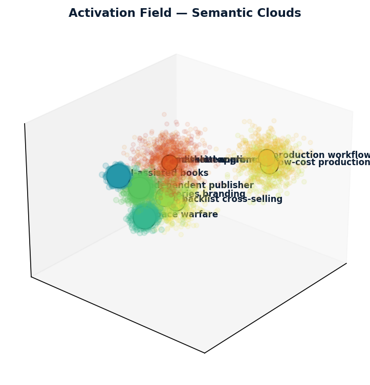

# Activation Field / Semantic Field Map Skill

A portable markdown skill for adding colorful semantic-field visualizations to LLM responses without exposing chain-of-thought.

The skill reframes an answer as emerging from an approximate semantic activation field: a small map of concepts most relevant to the response.

## What it does

When an LLM receives a prompt, it can display a compact visual map of the conceptual regions likely to shape the answer. This is an interpretive semantic visualization, not a transcript of model internals.

## Transparency notice

Activation Field maps do **not** reveal chain-of-thought, hidden reasoning, private deliberation, intermediate calculations, proprietary model state, or neural activations. They show only a high-level conceptual map intended to improve readability and understanding.

## Files

- `SKILL.md` — the single canonical skill definition (selectable `view` argument + computed render pipeline).
- `SEMANTIC_FIELD_MAP_SKILL.md` — pointer to `SKILL.md` (kept for older references).
- `scripts/semantic_map.py` — the one generator for every view: `topo` (continuous 2-D topographic), `surface` (3-D volume), `clouds` (3-D semantic clouds), `grid` (inline emoji text). Concepts are hand-placed JSON or `--derive`d from a prompt+answer pair (TF-IDF + PCA).
- `requirements.txt` — `matplotlib`, `numpy`, `scikit-learn` (the last only for `--derive`).
- `examples/` — sample derived-value tables/timings.
- `assets/` — sample rendered topographic, 3-D volume, and semantic-cloud PNGs.

## Visualization modes

- `emoji_ascii` — default colorful markdown map using emoji, spacing, and spatial layout.
- `contour_2d` / `topographic` — derived/computed continuous 2-D activation contour (heat-gradient fill + contour isolines).
- `volume_3d` — labeled 3-D semantic volume surface.
- `semantic_clouds` — semi-transparent 3-D activation clouds.

### Computed rendered views

The image views are computed from a real Gaussian-mixture scalar field over the concepts (positions + weights) — the continuous gradient, curved contours, and separate hills are genuine level sets of the field, not hand-drawn art. Labels are always the actual concepts from the answer, never generic placeholders.

```bash
# continuous 2-D topographic map
uv run python scripts/semantic_map.py --demo --view topo --out /tmp/semantic_field/topo.png
# 3-D volume surface (floating, non-colliding labels)
uv run python scripts/semantic_map.py --demo --view surface --out /tmp/semantic_field/volume.png
# 3-D semantic clouds (concepts derived from a prompt+answer pair)
uv run python scripts/semantic_map.py --derive --view clouds --out /tmp/semantic_field/clouds.png
```




When image output isn't available, fall back to the inline emoji grid:

```bash
uv run python scripts/semantic_map.py --demo --view grid
```

## Example prompt

> How should a small independent publisher decide whether to launch a short series of AI-assisted books about future space warfare?

## Default behavior

The default map style is `emoji_ascii`, the first portable emoji-driven version. Image-based maps are advanced options for demos, reports, notebooks, or environments where generated PNGs are useful.

See [SKILL.md](SKILL.md) for the full definition.
