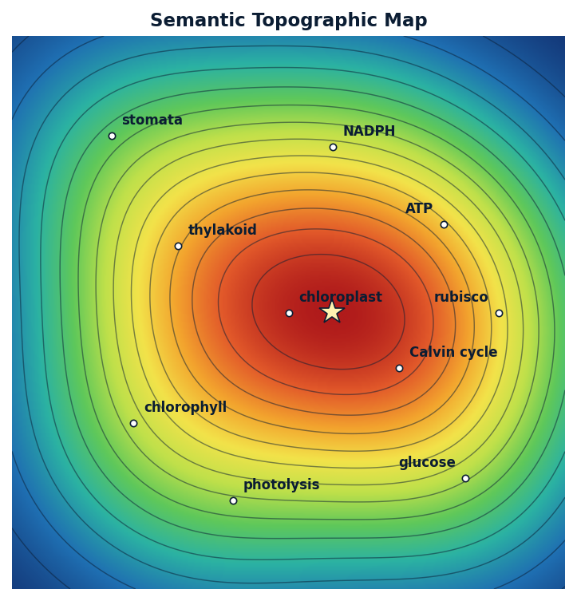
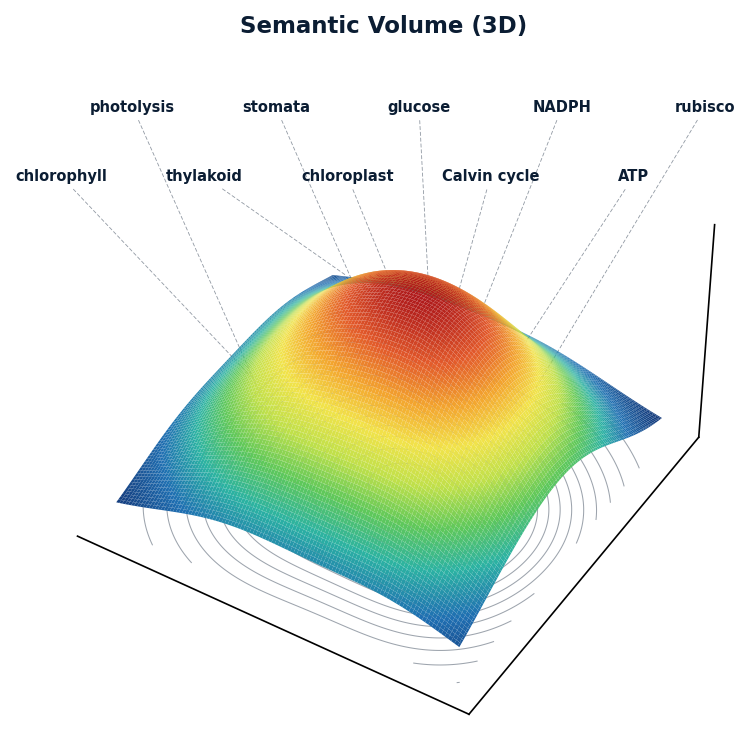

# Semantic Field Map Skill

A portable markdown skill for making LLM responses more spatial, colorful, and concept-aware without exposing chain-of-thought.

It adds a compact **Semantic Field Map** before answers, showing the conceptual landscape behind the response.

It also ships **computed** map views generated from a real Gaussian-mixture scalar field over the concepts (positions + weights) — the continuous gradient, curved contours, and separate hills are a genuine consequence of the field, not hand-drawn art. Labels are always the actual concepts from the answer, never generic placeholders.

- **Topographic map — continuous 2D (rendered PNG)** — a smooth heat-gradient surface with contour isolines (`scripts/topographic_map.py`, matplotlib + numpy):

  ```bash
  uv run python scripts/topographic_map.py --demo --mode topo --out /tmp/semantic_field/topo.png
  ```

  

- **Volume — 3D surface (rendered PNG)** — the same field as a continuous curved terrain:

  ```bash
  uv run python scripts/topographic_map.py --demo --mode surface --out /tmp/semantic_field/volume.png
  ```

  

- **Inline views** — a labeled text field map, plus a pure-stdlib emoji-grid fallback (`scripts/semantic_field.py`) for when image output isn't available.

See [SKILL.md](SKILL.md) for the full definition.
